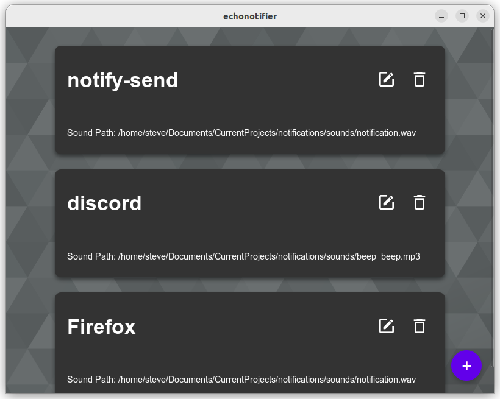
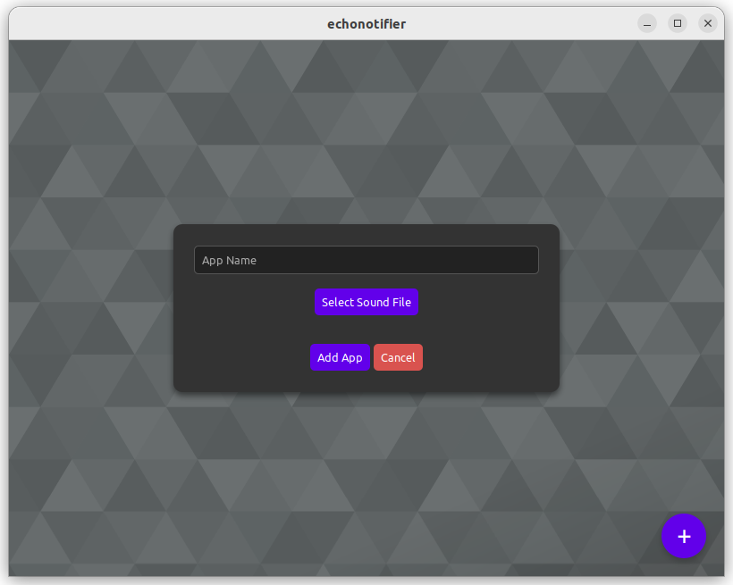
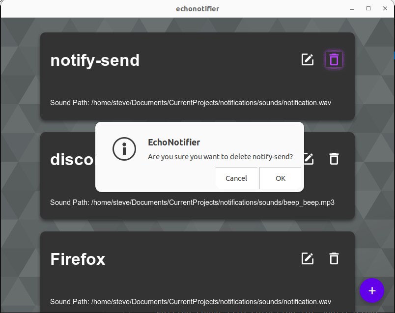

# Echo Notifier

I have developed this application that monitors dbus events for notifications and plays custom sounds for specific applications. Users can configure the application and customize the sound to be played. The reason behind creating this application was my frustration with using the Microsoft Teams web app on Linux. I was missing notifications as the app was not playing sounds. This application is probably not of much use to anyone else as it was developed to solve my specific problem.

Currently only supports wav and mp3 formats.
<div style="text-align: center;">
    <a href="https://www.buymeacoffee.com/swingline" target="_blank">
        
    </a>
</div>

## Dependancies 
This application requires:
- mpg321 `sudo apt install mpg321`

## Usage 

**Note:** Any changes to the config.json file will require a restart of the application. This will be fixed in the next release.

If you dont use the .deb file to install then you will need to put the config.json file in `~/.config/echonotifier/config.json` or update the path in line 15 of main.rs.
```Rust
fn config_path() -> PathBuf {
    home_dir().expect("Could not find home directory").join(".config/echonotifier/config.json")
}
```
For esting `notify-send` can be used to see if sounds are working correctly. Here is an example command `notify-send "testing" "This is a test"`

## Whats mostly working 
- Adding applications
- Editing sound file selection for applications
- deleting applications

## TODO
- [ ] Restart the thread watching dbus after config changes are made.
- [ ] Clean up application card style. 

## Screenshots




